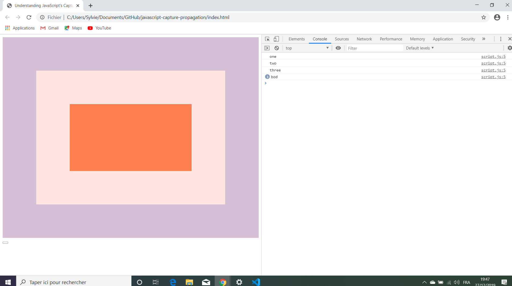

# :zap: Javascript Capture Propagation

* Wes Bos Youtube Tutorial: [JavaScript Event Capture, Propagation and Bubbling - #JavaScript30 25/30](https://www.youtube.com/watch?v=F1anRyL37lE&index=25&list=PLu8EoSxDXHP6CGK4YVJhL_VWetA865GOH).

*** Note: to open web links in a new window use: _ctrl+click on link_**

## :page_facing_up: Table of contents

* [General info](#general-info)
* [Screenshots](#screenshots)
* [Technologies](#technologies)
* [Setup](#setup)
* [Features](#features)
* [Status](#status)
* [Inspiration](#inspiration)
* [Contact](#contact)

## :books: General info

* Tutorial Code to understand how Javascript event capture works in triggering events and how to prevent propagation.

## :camera: Screenshots

.

## :signal_strength: Technologies

* [Javascript v1.9 ECMA-262 ECMAScript 2018](http://www.ecma-international.org/publications/standards/Ecma-262.htm)

## :floppy_disk: Setup

* Open index.html in browser. If any code is changed the browser needs to be refreshed.

## :computer: Code Examples

* logs text on screen for each div.

```javascript
divs.forEach(div => div.addEventListener('click', logText, {
  capture: true,
  once: true //listens for a click then unbinds itself
}));
```

## :cool: Features

*  The bubbling principle: When an event happens on an element, it first runs the handlers on it, then on its parent, then all the way up on other ancestors. The process is called “bubbling”, because events “bubble” from the inner element up through parents like a water bubble. The method to stop bubbling is event.stopPropagation()

## :clipboard: Status & To-Do List

* Status: Working.
* To-Do: N/A

## :clap: Inspiration

* [JavaScript Event Capture, Propagation and Bubbling - #JavaScript30 25/30](https://www.youtube.com/watch?v=F1anRyL37lE&index=25&list=PLu8EoSxDXHP6CGK4YVJhL_VWetA865GOH)

## :envelope: Contact

* Repo created by [ABateman](https://www.andrewbateman.org) - you are welcome to [send me a message](https://andrewbateman.org/contact)
